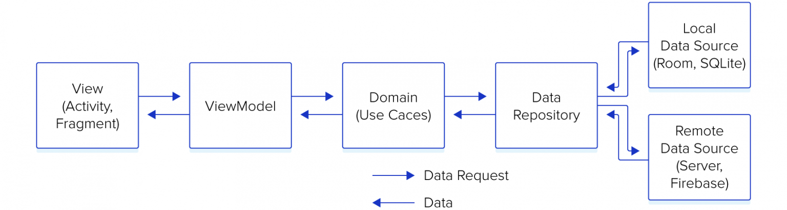

# Music search Android Application

<p float="left">


</>

## About
Android application with instant search for music


## Dependencies Direction



## Package Structure


## This project uses:
- Kotlin
- [Gson](https://github.com/google/gson)
- [Dependency injection with Hilt](https://developer.android.com/training/dependency-injection/hilt-android)
- [Android DataBinding Library](https://developer.android.com/topic/libraries/data-binding)
- Clean Architecture guide line
- MVVM as ui pattern and LiveData
- [Coroutines](https://developer.android.com/kotlin/coroutines)
- [Flow](https://developer.android.com/kotlin/flow)

## JacocoReport and SonarQube
- [Download java 11](https://www.oracle.com/java/technologies/javase-jdk11-downloads.html)
- [Download SonarQube](https://www.sonarqube.org/downloads/)
- For windows run StartSonar.bat file
- For mac run sonar.sh start
- Open localhost:9000 panel
- Run ```gradlew jacocoTestReport sonarqube``` in android studio terminal

